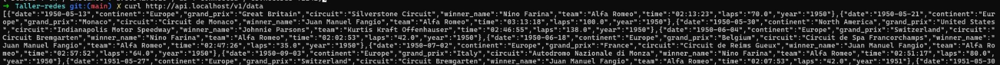

# Taller-de-servicios-con-Traefik

## Integrantes
- David Fernando Cifuentes Bohorquez - 202221101
- Alec Fabian Corzo Salazar - 202220646

### 1) Topología y redes (Compose)
● Una red de aplicación única donde vivan: traefik, api (réplicas), neo4j.
● No publicar puertos del contenedor de Neo4j hacia el host (acceso solo
interno).
● Traefik con entrypoint web (:80).

Se modifica el Dockercompose

Evidencia de que ya no funciona sin los puertos

### 2) Rutas “estructuradas”
● API disponible en http: /api.localhost/ o
http: /api.localhost/v1/.
● Dashboard de Traefik disponible únicamente en:
○ http: /ops.localhost/dashboard/ y protegido por middleware
(ver punto 3)

Se muestra el curl con el status y que responde a 200

solicita credenciales o es inaccesible si no pasa por el middleware de protección.

### 3) Middlewares (mínimo 2 de estos)
● Auth básica para el dashboard (ops.localhost/dashboard/).
● stripPrefix si usan prefijos tipo /api o /dashboard.
● rateLimit para la API (p. ej., limitar a X req/seg)

### 4) Balanceo (réplicas de la API)
● Levantar 2 réplicas de la API detrás del mismo router/servicio de Traefik.
● Verificar con varias peticiones que se reparten entre instancias (hostnames
distintos, logs, o contador).

### 5) Descubrimiento automático
● Configurar la API con labels de Traefik (sin archivos de config estáticos) para
routers, middlewares y service.
● Al escalar la API (p. ej., -scale api=2), Traefik detecta las nuevas
réplicas sin reiniciarse.

### 6) Observabilidad y pruebas
● Endpoint /health en la API (200 OK).

● Probar: listar/crear en su API.

● Comprobar en el dashboard: Routers, Services, Middlewares activos.

